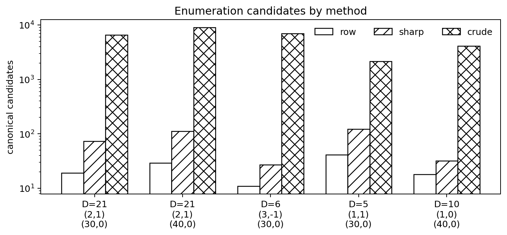
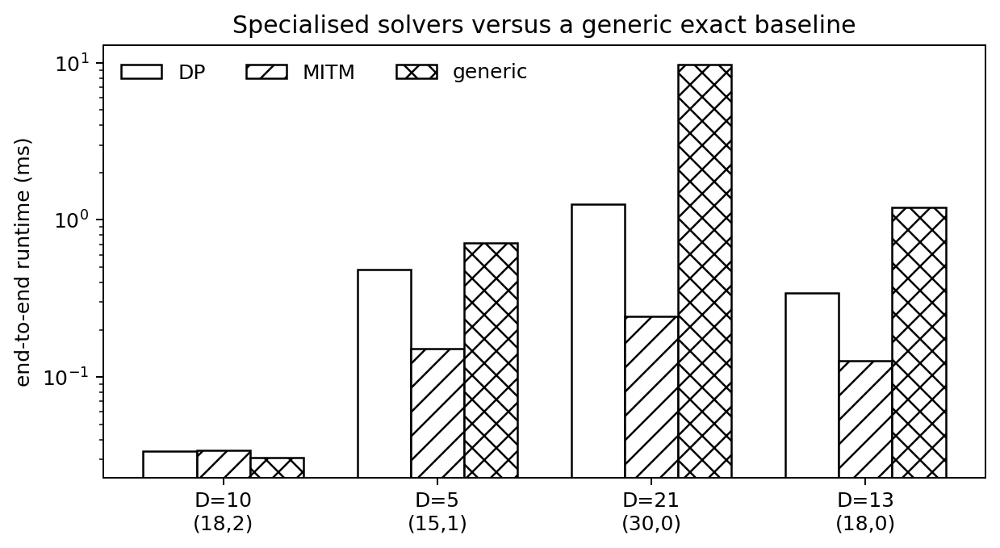
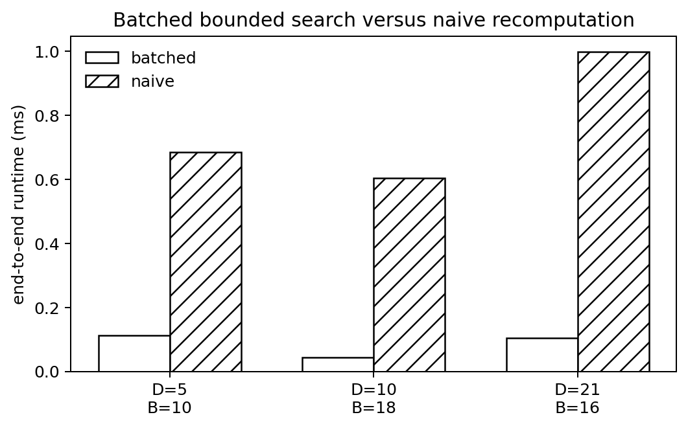
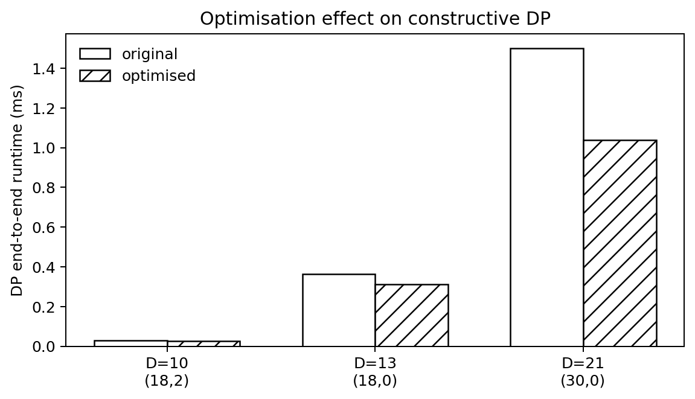

# quadratic_diagonal

**Exact diagonal representability over real quadratic orders**

Version: **0.2.0** (TOMS submission refresh)

Public repository (intended submission/software URL):
<https://github.com/tomaszkania/quadratic_diagonal>

This repository contains the reference Python implementation accompanying the
paper *Exact diagonal representability over real quadratic orders via weighted
trace-form enumeration*. The package is designed as a transparent,
reproducible software artefact: the same public API is used by the paper's
benchmark scripts, validation sweep, executed notebook, and regression tests.

The repository is organised in the same spirit as the companion public
repository [`quadratic_sos`](https://github.com/tomaszkania/quadratic_sos),
which treats the unweighted sum-of-squares case. The implementation is written
in pure Python on purpose: it serves as an executable reference
implementation, is easy to inspect and test, and can be translated into
compiled code or integrated directly into SageMath-style Python workflows.

## What the software does

For a squarefree integer `D >= 2`, a diagonal coefficient list
`a_1, ..., a_r in O_D^+`, and a totally positive target `alpha in O_D^+`, the
package computes:

- **Weighted search**: distinct weighted values `a x^2` with
  `0 < a x^2 <= alpha`
- **Constructive representability**: whether
  `alpha = a_1 x_1^2 + ... + a_r x_r^2` with `x_i in O_D`
- **Representation witnesses**: an explicit root tuple when one exists
- **Meet-in-the-middle search**: the same decision/witness problem via MITM
- **Bounded batched search**: all representable targets and bounded truants up
  to a trace bound
- **Evaluation data**: structural counts, timing splits, optimisation effects,
  validation sweeps, and a reproducible generic exact baseline for comparison

## Public API

The central package entry points are:

- `RealQuadraticOrder`
- `enumerate_weighted_search`
- `diagonal_representability_dp`
- `diagonal_representability_mitm`
- `batched_bounded_representables`
- `bounded_truants_batched`

## Repository layout

| Path | Purpose |
|---|---|
| `src/quadratic_diagonal/` | Core package |
| `tests/test_all.py` | Regression tests and brute-force cross-checks |
| `notebooks/paper_illustrations.ipynb` | Executed notebook illustrating the algorithms |
| `scripts/reproduce_tables.py` | Regenerates the TSV tables in `data/` and the performance plots in `paper/figures/` |
| `scripts/validation_sweep.py` | Small-family bounded-truant validation sweep |
| `data/` | Generated TSV tables used in the computational section |
| `paper/figures/` | Generated performance plots |
| `paper/` | LaTeX source and PDF of the manuscript |

## Installation

```bash
pip install -e .
```

Optional extras:

```bash
pip install -e .[test]
pip install -e .[repro]
```

## Quick start

```python
from quadratic_diagonal import RealQuadraticOrder, diagonal_representability_dp

O = RealQuadraticOrder(21)
coeffs = [(2, 1), (1, 0), (1, 0), (1, 0)]
alpha = (30, 0)

result = diagonal_representability_dp(O, coeffs, alpha)
print(result.represented)
print(result.roots)
```

## Software availability and reproducibility

The repository is intended to remain public at the URL shown above. The paper
links to this repository directly, and the repository contains everything
needed to reproduce the computational section:

```bash
python -m pytest -q
python scripts/reproduce_tables.py
python scripts/validation_sweep.py --fields 5 6 10 13 21 --trace-bounds 8 12 16
jupyter notebook notebooks/paper_illustrations.ipynb
```

The structural benchmark columns are deterministic. Timing columns depend on
machine and Python environment, which is why the paper separates structural
counts from runtime measurements.

## Performance plots

The script `scripts/reproduce_tables.py` also regenerates the plots below.
These plots are intended to visualise the relative gains from the algorithmic
choices in the paper rather than to compete with compiled computer algebra
systems in absolute wall time. To keep the artefact self-contained, the paper
benchmarks the specialised routines against a reproducible generic exact
baseline implemented in the package, rather than against an external CAS that
would introduce non-portable dependencies.

### Enumeration candidates by method



### Specialised solvers versus a generic exact baseline



### Bounded batched search versus naive recomputation



### Ordering and caching optimisation for constructive DP




## TOMS Algorithm-paper artefact

The repository is prepared as a TOMS Algorithm-paper software component and the manuscript source in `paper/` uses the ACM `acmart` single-column review format.  The
core package has no runtime dependency outside the Python standard library.  The
non-interactive smoke-test command for referees is:

```bash
python -m pip install -e .[repro]
python scripts/run_all_checks.py
```

The smoke test runs the regression suite, regenerates representative data, and
writes `data/run_all_checks_summary.txt`.  Full reproduction scripts and the
executed notebook are included in the repository.  A separate convenience archive for the TOMS software component can be generated with
`python scripts/make_submission_archive.py` and is written to `submission/`.

Optional external-CAS checks can be probed with:

```bash
python scripts/optional_cas_baselines.py
```

Those checks are intentionally outside the mandatory smoke-test path because
SageMath and PARI/GP availability varies between systems.

## Citation

If you use this software, please cite the accompanying manuscript in `paper/`.
GitHub citation metadata is also provided in `CITATION.cff`.

## Author

Tomasz Kania  
Institute of Mathematics, Czech Academy of Sciences  
Institute of Mathematics, Jagiellonian University

## License

MIT
